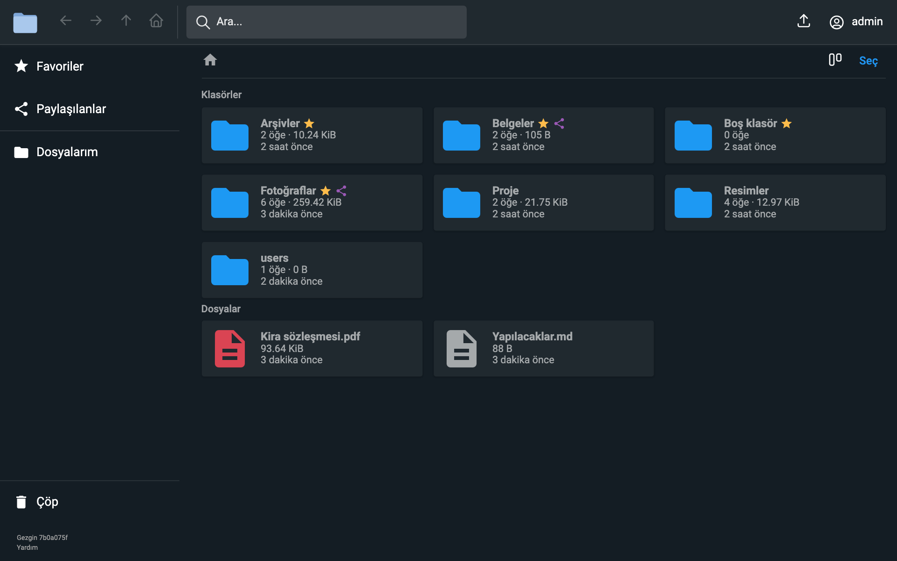
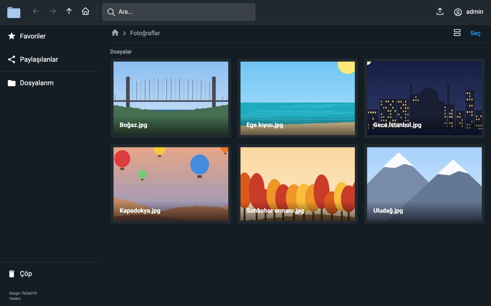
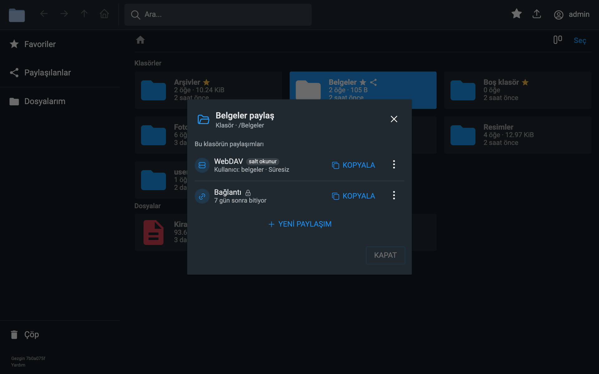
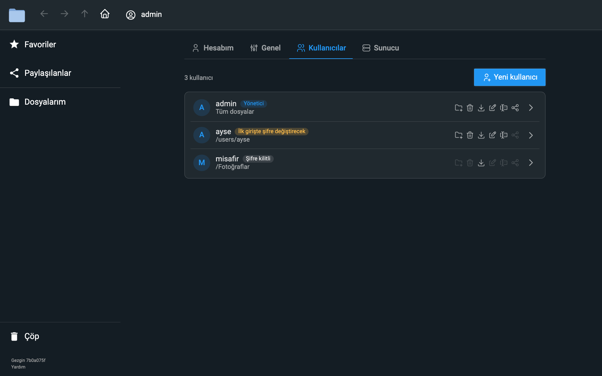
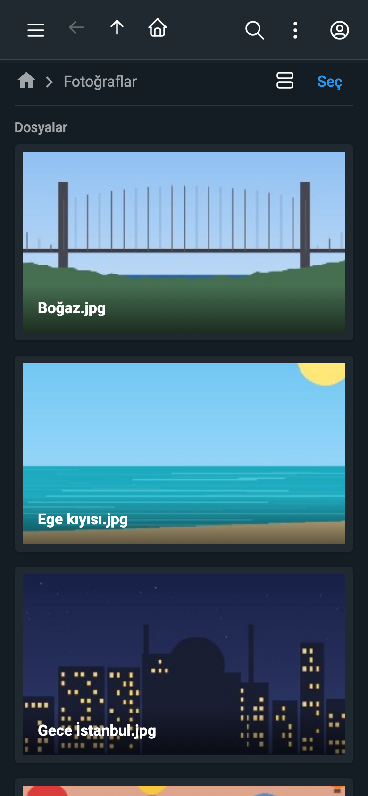

<p align="center">
  
</p>

<h1 align="center">Gezgin</h1>

<p align="center">
  A self-hosted file manager for your own server, in Turkish and English.<br>
  Trash, favourites, link and WebDAV sharing, archives and folder sizes, in one web app.
</p>

<p align="center">
  <a href="https://github.com/drs0me1/gezgin/actions/workflows/gezgin-image.yml"></a>
  <a href="LICENSE"></a>
  
</p>

---

Gezgin is the file manager of the [Konsol](https://github.com/drs0me1/myserver) server panel. It
began as a fork of [File Browser](https://github.com/filebrowser/filebrowser), which was archived on
2026-09-01, and has since been reworked part by part: what was unsafe or unused is gone, and what
a home server needs has been added.

> **Status:** in active development. There are no releases yet; the container image follows `main`.

<p align="center">
  
</p>

## Features

| Feature | What it does |
|---|---|
| **Trash** | Deleted items go to each user's own trash, to be restored or deleted for good; they expire after 30 days. |
| **Favourites** | Star files and folders and reach them from the "Favoriler" page. |
| **Shares page** | Every link and WebDAV share in one place, with its end, password and owner. |
| **WebDAV shares** | Share a folder with Finder, Infuse or any WebDAV app, read-only or read-write. |
| **Share dialog** | Pick an end in one click, add a password, and copy the address as soon as it is made. |
| **Archives** | Open ZIP, RAR, 7z and tar archives on the server; make ZIP, tar or tar.gz, also in parts. |
| **Folder sizes** | Every folder shows how many items it holds and how big it is. |
| **Search** | Type in the bar; Turkish letters and accents do not matter; results open as a folder. |
| **Navigation** | Back, forward, up and home buttons, right-click menus and tick-box selection. |
| **Settings** | Four tabs, for your account, the general settings, the users and the server. |
| **Users** | An own folder per user, permissions at a glance, a new password asked at the next login. |
| **Safe writes** | Uploads and saves replace a file only once complete; a full disk is refused at the start. |
| **Security** | A strict content security policy, limits on password guesses, sessions that end with a password change. |
| **Two languages** | The whole interface in Turkish and in English; each user picks theirs, Turkish by default. |

## Screenshots

| Photos as a gallery | Sharing a folder |
|---|---|
|  |  |
| **The users** | **On a phone** |
|  | <p align="center"></p> |

The screenshots show sample files on a test server.

## What changed from File Browser

| | File Browser | Gezgin |
|---|---|---|
| Deleting | Gone for good | Into the trash, restorable for 30 days |
| Signing in | Password, proxy, hook, none, reCAPTCHA, self-signup | Password only; the admin creates the accounts |
| Password guesses | Unlimited | Limited per address and per username |
| Sessions | Last until they expire | End when the password changes, or on "close all sessions" |
| Languages | Over 30 | Turkish and English, both complete (the others lacked Gezgin's own texts) |
| Text editor | Loaded from a CDN, about 40 themes | Built in, follows the theme, opens Turkish (Windows-1254) texts, warns before overwriting |
| Uploads | A partial file is visible meanwhile | Kept aside until complete; a full disk is refused up front |
| Downloads | ZIPs stored without compression | Compresses what is not compressed yet; the download permission holds everywhere |
| Share links | Point at the old place after a move | Follow their item, and end when it is deleted |
| Shell commands | Optional, with file event hooks | Removed |
| Look | File Browser's | Its own logo, outline icons, a new header, sidebar and settings |
| Browsers | A legacy build for old browsers | Browsers from about 2022 on; 5 MB smaller |

Also removed: the EPUB reader, the Redis upload cache, the branding options and the editor's theme
setting. Every change, with its limits, is listed in [docs/changes.md](docs/changes.md).

## Quick start

Gezgin runs as a container. With Podman (Docker takes the same options):

```bash
podman run -d --name gezgin \
  -p 8080:8080 -p 8092:8092 -e FB_WEBDAV_PORT=8092 \
  -v gezgin-db:/database -v gezgin-config:/config \
  -v /path/to/your/files:/srv \
  ghcr.io/drs0me1/gezgin:main
```

1. Open `http://<your server>:8080`.
2. Sign in as `admin` with the password in the log (`podman logs gezgin`).
3. Choose your own password; Gezgin asks for it at this first login.

The container runs as user `1000`, which needs write access to the files folder. Leave out the
`8092` options if you do not need WebDAV shares.

## Configuration

| Variable | Default | What it sets |
|---|---|---|
| `FB_WEBDAV_PORT` | off | The port of the WebDAV shares |
| `FB_TOKEN_EXPIRATION_TIME` | `2h` | How long an unused session lasts |
| `FB_BASE_URL` | none | A path prefix, behind a reverse proxy |
| `FB_PORT` | `8080` | The web port inside the container |
| `FB_CACHE_DIR` | `/database/cache` | Where thumbnails are kept |

Every option is in the [command line reference](docs/cli/filebrowser.md). The admin changes the
rest in the web app, under **Ayarlar**.

## Development

| Task | Command |
|---|---|
| Package and run on a Mac (Podman) | `scripts/test-env.sh build start`, then `http://127.0.0.1:8091` |
| Go tests and lint | `go test ./...` and `golangci-lint run ./...` |
| Frontend checks | `cd frontend && npm run lint && npx vue-tsc --noEmit -p tsconfig.app.json && npx vitest run` |
| Build by hand | `cd frontend && pnpm install && pnpm run build && cd .. && go build -o filebrowser .` |

The program is still called `filebrowser` and the Go module path stays
`github.com/filebrowser/filebrowser/v2`. Decisions and work notes are in
[HANDOVER.md](HANDOVER.md).

## Documentation

- [Changes from File Browser, in detail](docs/changes.md)
- [Authentication](docs/authentication.md)
- [Customization](docs/customization.md)
- [Troubleshooting](docs/troubleshooting.md)
- [Command line reference](docs/cli/filebrowser.md)
- [Security policy](SECURITY.md)

## Credits and license

Gezgin is built on [File Browser](https://github.com/filebrowser/filebrowser) by its contributors,
and draws its icons from [Tabler Icons](https://tabler.io/icons) (MIT). It is licensed under the
Apache License 2.0, as File Browser is; see [LICENSE](LICENSE) and [NOTICE](NOTICE). Gezgin is not
affiliated with the File Browser project.
